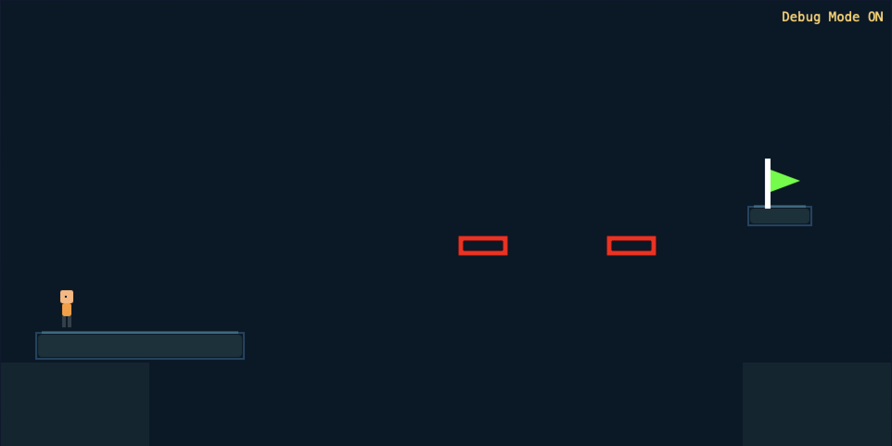

# Echo Step — 2D-платформер с механикой эхо

**Онлайн-версия**: [сыграть прямо сейчас](https://websim.com/@m3r1al/echo-step)
**Версия**: `v1.0-final`

## 🎮 Описание
Платформенная игра, разработанная через **вайбкодинг в WebSim**, где игрок создаёт временные копии (эхо) для решения головоломок.
- 10 уровней с уникальными механиками (кнопки, триггеры и эхо).
- Debug-режим для быстрого переключения уровней (Включается кнопкой ~).
- Полностью реализована в рамках учебного проекта

## 📂 Структура проекта
/echo-step
├── index.html # Главный файл игры
├── main.js # Логика уровней, эхо и триггеров
├── style.css # Стили интерфейса и визуальных эффектов
├── screenshots/ # Скриншоты для документации
│ ├── level9.png
│ └── level10.png
├── docs/
│ ├── technical-spec.md # Техническое задание
└── README.md # Этот файл

> 💡 **Примечание**:
> Простая структура (3 файла) сохранена из-за ограничений экспорта WebSim.
> Все уровни и механики интегрированы в `main.js`.

## 🚀 Как запустить
### Вариант 1: Онлайн
Просто перейдите по ссылке:
👉 [https://your-username.github.io/echo-step](https://websim.com/@m3r1al/echo-step)

### Вариант 2: Локально
1. **Требования**: Python 3.x (установите с [python.org](https://python.org)).
2. Запустите сервер из **корневой папки проекта**:
   python3 -m http.server 8000
  
### Вариант 2: Откройте в браузере:
   http://localhost:8000
    ⚠️ Важно!
   Не открывайте index.html двойным кликом — это вызовет пустой синий экран из-за CORS-ограничений.
   Всегда используйте статический сервер!
   
    🔧 Управление
   
   ←/→/↑/↓: Движение и прыжок
   E: Создать эхо (максимум 3)
   R: Перезапустить текущий уровень
   
   ~: Включить/выключить debug-режим
   В debug-режиме: 1-9, 0 → мгновенный переход к Level 1-10
   
    🖼️ Скриншоты
   
   Level 9 (триггеры)
   
   
   
   Красные прямоугольники — триггеры 1.5×0.5 в позициях (15.0, 3.0) и (20.0, 3.0). Зелёная платформа появляется при их одновременной активации.
   
   Level 10 (кнопки)
   
   
   
   Кнопки в углах активируются эхо. Флаг становится зелёным только при одновременном нажатии.
   
   📄 Документация
   
   [Техническое задание](docs/technical_spec.md) — полное описание механик по ГОСТ.
   [Пользовательская документация](docs/user_manual.md) - Руководство пользователя с инструкциями по прохождению
   [Техническая документация](docs/technical_documentation.md) - Техническая документация для разработчиков
   [Аналитическая документация](docs/analytical_documentation.md) - Аналитическая документация с исследованиями и оценкой эффективности
   
    🏷️ Версионность
   
   Проект зафиксирован тегом v1.0-final.
   Сборка проверена на:
   Chrome 140+, Firefox 140+, Safari 17.0